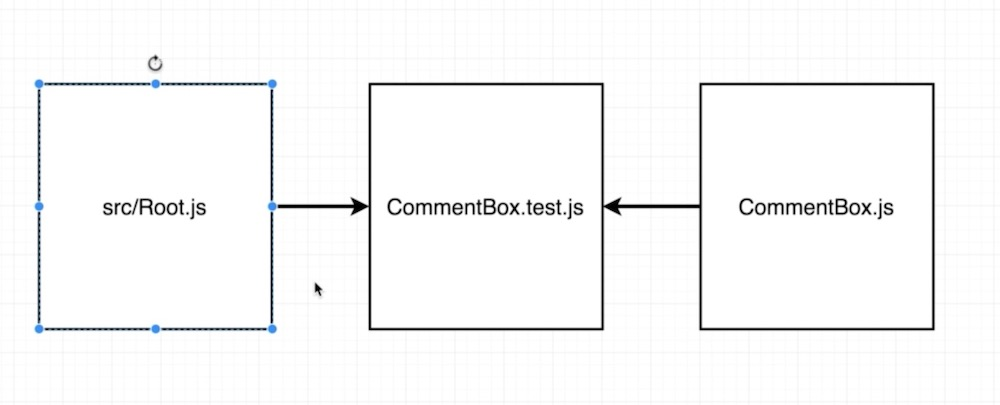

These are my notes on the the excellent <https://github.com/StephenGrider> course on unit testing you can find here <https://www.udemy.com/react-redux-tutorial/>

a thing to remember throughout —\> jest creates a fake/pseudo/virtual dom to test it is not testing in the browser

**Startup**
===========

create-react-app

Start off with a new create-react-app

In the create-react-app we get React, Webpack, Babel and…. —\> Jest

**Jest does the testing**

At the terminal ’npm run test’ will start jest

Jets finds all files ending in ‘.test’

prints out results and waits for files to change before running again

Our Project
===========

npm i redux react-redux

**Component Design**


**Redux Design**


To begin testing, **it’s important** to delineate parts of your app and explain what each part does. This approach means from the get go we know what needs testing

Being able to explain the app and what each component does is a skill itself and will help in development and testing

Heres an examples of explaining the functionality of a app and what we are going to test


Building the project
====================

delete the contents of the /src dir and replace with these files 


—\> index.js

```jsx
import React from 'react'
import ReactDOM from 'react-dom'
import App from './components/App'

ReactDOM.render(<App />, document.querySelector('#root'))
```

—\> App.js

CommentBox/List are react comp

```jsx
import React from 'react';
import CommentBox from "./CommentBox";
import CommentList from "./CommentList";

const App = () => (
    <div>
        <CommentBox />
        <CommentList />
    </div>
);

export default App;
```

**Never to early to start a test…**

**Test Setup**
==============

create a test directory

—\> src/components/\_\_tests\_\_/App.test.js

The main construct we wil use repeatedly in our test

***“it” ***The global function is used every-time we want to write out a new test

**“desc of test” **is just for developers it does nothing to the test code

**“function”** : the actual test


```jsx
it('desc of test', ()=> {
    //codeblock
})
```

How is jest working
-------------------

The big Q?

React runs in the browser but jest is run and displayed in the terminal CLI

A: Jest relies on JSDOM, a library which creates a phantom browser environment

This means when tests are running the app is not really existing, it solely lives in memory in the terminal


A simple test
-------------

This is going to console log the html in the app, 

And test to see if “CommentBox” exists inside the div somewhere

```jsx
import React from 'react';
import ReactDOM from 'react-dom'
import App from '../App'

it('shows a comment box', ()=> {
    //👇 basically running the app,this is the 
    // remember this is the default test in create-react-app
    const div = document.createElement('div')
    ReactDOM.render(<App />, div)

    console.log(div.innerHTML);
    expect(div.innerHTML).toContain('CommentBox')
    // 👇 clean up after the test, unmount coms, destroy any object
    ReactDOM.unmountComponentAtNode(div);
})
```

Expectations/matcher

---------------------

What we expect from the test

What the expectation should match 


Whats wrong with our previous example
-------------------------------------

Your tests should not be concerned with the inner workings of another component

It’s ok to know if the other component exists but any deeper than that is a no no

enzyme 
-------

<https://airbnb.io/enzyme/>

<https://airbnb.io/projects/enzyme/>

install two modules

```jsx
// the 16  is the version of react we are running
$ npm i enzyme enzyme-adapter-react-16
```

**setup enzyme**
----------------

### —\> src/setupTests.js

Whenever jest runs it will look for setupTests.js for any configuration stuff

```jsx
import Enzyme from 'enzyme';
import Adapter from 'enzyme-adapter-react-16'

Enzyme.configure({ adapter: new Adapter() })
```

Why Enzyme?
===========

in the previous example we 1) created a dic 2)rendered the App init 3) set a expectation on the the div 4)un mounted the div

```jsx
it('shows a comment box', ()=> {
    1). onst div = document.createElement('div')
    2). ReactDOM.render(<App />, div)
    3). expect(div.innerHTML).toContain('CommentBox')
    4). ReactDOM.unmountComponentAtNode(div);
})
```

With enzyme we can skip that render into a div part

### With enzyme we can render in three ways, this will send back an object we can run the tests on

Three render fn’s, 

 Static - takes the comp, renders and returns an object containing the plain html - to test the html

 Shallow - renders just the comp (no children) - to test one comp in isolation

 FullDom - renders everything (and children) returns an object is interactive, clicking etc


**// We are trying to run a test that checks if an instance of CommentBox exist inside the app**

shallow —\> shallow render()
----------------------------

<https://airbnb.io/enzyme/docs/api/ShallowWrapper/shallow.html>

<https://airbnb.io/enzyme/docs/api/ShallowWrapper/find.html>

With enzyme we are going to refactor our original test to see if there is a comment box in the App

### 👇👇👇👇 Original 👇👇👇👇

```jsx
it('shows a comment box', ()=> {
    const div = document.createElement('div')
    ReactDOM.render(<App />, div)
    console.log(div.innerHTML);
    expect(div.innerHTML).toContain('CommentBox')
    ReactDOM.unmountComponentAtNode(div);
})
```

### 👇👇👇The enzyme version 👇👇👇👇

We need to import the shallow method,

***const wrapped = shallow(\<App /\>)...***

wrapped == this is a comp with additional functionality added on top

The documentation says used ‘wrapped’ — Stephen doesn’t think this is good because really it’s still just the component

We could have called it anything but expect to use wrapped

***expect(wrapped.find(Co….***

.find() returns an array with all the instances of commentBox found, 

***(CommentBox).length).toEqual(1);***

*We only want to check if a single instance exists*

***
***

```jsx
import React from 'react';
import { shallow } from 'enzyme'
import App from '../App'
import CommentBox from '../CommentBox'
import CommentList from "../CommentList";

it('shows a comment box', () => {
    const wrapped = shallow(<App />)
    // or it could be ****-->  const compoonent = shallow(<App />)
    expect(wrapped.find(CommentBox).length).toEqual(1);
})
```

Break the test…
---------------

After you get a clean sweep of the test try breaking it just to check you are not getting a erroneous response 

 👇

expect(wrapped.find(CommentList).length).toEqual(1001)

Absolute Paths
==============

maybe you don’t like the dot dot slash

import CommentList from "../CommentList";

If you want to use absolute pathes then in .env

NODE\_PATH=src/

Now you can use

import CommentList from "components/CommentList";

and it seems to work with either 🧐

beforeEach(()=\>{})
===================

Common setup for all tests inside the same file

Reuse logic in multiple expectations

One thing to remember is SCOPE

You must define the variable outside of the beforeEach() to make it accessible to the other fns

WHY let not const

BECASUE we are going to want to redefine the value of wrapped many times

```jsx
let wrapped;

beforeEach(()=>{
    wrapped = shallow(<App />)
})

it('shows a comment box', () => {
    expect(wrapped.find(CommentBox).length).toEqual(1);
})

it('shows a comment list', () => {
    expect(wrapped.find(CommentList).length).toEqual(1)
})
```

the comment box component
=========================

```jsx
import React from 'react';
class CommentBox extends React.Component {

    state = { comment: '' }

    handleChange = (event) => {
        this.setState({ comment: event.target.value })
    }

    handleSubmit = (event) => {
        event.preventDefault()
        // TODO: call an action creator
        // save the comment
        this.setState({ comment: '' })
    }

    render() {
        return (
            <form onSubmit={this.handleSubmit}>
                <h4>add a comment</h4>
                <textarea value={this.state.comment} onChange={this.handleChange} cols="30" rows="10" />
                <div>
                    <button type="submit">Submit</button>
                </div>
            </form>
        );
    }
}

export default CommentBox
```

We want to test the comment box comp
------------------------------------

* shows a text area and btn
* Users an enter input into the text and submit
* after submit, textarea is cleared

Which enzyme handler do we want?

OBVS —\> shallow

\_\_tests\_\_/CommentBox.test.js
--------------------------------

**But we are going to use FULL DOM just for kicks**

<https://airbnb.io/enzyme/docs/api/mount.html>**
**

*'Note: unlike shallow or static rendering, full rendering actually mounts the component in the DOM, which means that tests can affect each other if they are all using the same DOM. Keep that in mind while writing your tests and, if necessary, use [`.unmount()`](https://airbnb.io/enzyme/docs/api/ReactWrapper/unmount.html) or something similar as cleanup.**’*

*
*

👆basically you better unmount() - cleanup your test - or this is going to screw up everything

**
**

to do a FULL DOM render we use the method “mount”

we can use find() for component instances and also html

<https://airbnb.io/enzyme/docs/api/ShallowWrapper/find.html>

👏🎉 we can use console.log() in the test 👏🎉

Shows up in the CLI not the browser dev tools, a good way to check stuff before writing the assertions

```jsx
import React from 'react'
import CommentBox from "components/CommentBox";
import { mount } from 'enzyme';

it('has a textarea and btn', () => {
    const wrapped = mount(<CommentBox />)
    console.log(wrapped.find('textarea'));
    console.log(wrapped.find('button'));
});
```

now with the expectations

```jsx
it('has a textarea and btn', () => {
    const wrapped = mount(<CommentBox />)
    expect(wrapped.find('textarea').length).toEqual(1);
    expect(wrapped.find('button').length).toEqual(1);
});
```

Still TODO
----------

the beforeEach() and the test cleanup with afterEach and unmount()

<https://airbnb.io/enzyme/docs/api/ReactWrapper/unmount.html>

```jsx
import React from 'react'
import CommentBox from "components/CommentBox";
import { mount } from 'enzyme';

let wrapped;

beforeEach(() => {
    wrapped = mount(<CommentBox />)
})

it('has a textarea and btn', () => {
    expect(wrapped.find('textarea').length).toEqual(1);
    expect(wrapped.find('button').length).toEqual(1);
});

afterEach(()=>{
    wrapped.unmount();
})

```

Next Test —\> User can input in text area
=========================================

<https://airbnb.io/enzyme/docs/api/ReactWrapper/simulate.html>

What we are really testing here is that the textarea is set up with the state and onChange handler correctly

SIMULATION: We are going to trick the test to make it think we are entering text into the textarea

The simulate syntax, two args —\> the event, the mock event obj


### **1\. Find the textArea**

```jsx
it('should let users type in the textarea', () => {
    expect(wrapped.find('textarea')
});
```

### **2\. Simulate change event**

<https://airbnb.io/enzyme/docs/api/ReactWrapper/simulate.html>

We are simulating change in the form NOT the react method onChange

```jsx
it('should let users type in the textarea', () => {
    expect(wrapped.find('textarea').simulate('change')
});
```

### **3\. Provide fake event**

****

```jsx
it('should let users type in the textarea', () => {
   wrapped.find('textarea').simulate('change', {
        target: { value: "any old string" }
    });
});
```

Fooling the the onChange fn to run

This is the event handler AND LOOK 👀👇👀👇👀👇

 handleChange = (event) =\> {

 this.setState({ comment: event.target.value })

 }

👀👇👀👇👀👇👀👇AND LOOK ==\> event.target,value 👀👇👀👇👀👇

simulate = event

target = target

value = value

```jsx
 wrapped.find('textarea').simulate('change', {
        target: { value: "any old string" }
    });
```

### **4\. Force component to update**

**WHY?**

WE ALL KNOW in react when we cal setState our component automatically re-renders

BUT YOU DIDN'T KNOW that the re-render does not occur instantly (asynchronously) it queues it up 

No good for our test, so instead of waiting for react to decide when to re-renderwe will force the re-render, force the value into the text box and then make our assertion

enzyme method for this is…. update()

<https://airbnb.io/enzyme/docs/api/ReactWrapper/update.html>

```jsx
it('should let users type in the textarea', () => {
   wrapped.find('textarea').simulate('change', {
        target: { value: "any old string" }
    });
    wrapped.update()
});
```

### 5\. Assert the textarea value has changed

We need to use another enzyme method to locate the value property/ prop

.prop() <https://airbnb.io/enzyme/docs/api/ReactWrapper/prop.html>

```jsx
it('should let users type in the textarea', () => {
   wrapped.find('textarea').simulate('change', {
        target: { value: "any old string" }
    });
    wrapped.update()
    expect(wrapped.find('textarea').prop('value')).toEqual('any old string')
});

```

don't forget —\> now make the file break/fail

Next Test —\> textarea cleared after submit
===========================================

```jsx
it('should clear textarea on submit', () => {
    // find the teaxtarea and simulate some text being entered
    wrapped.find('textarea').simulate('change', {
        target: { value: "any old string" }
    });

    //force the comp to rerender and make sure the value prop has changed
    wrapped.update()

    // simulate the form being submitted
    wrapped.find('form').simulate('submit');

    // force the comp to rerender after the form has submitted
    // and set the value of the text area 
    wrapped.update();

    // Now we can make the aseertion
    expect(wrapped.find('textarea').prop('value')).toEqual('')

});
```

Refactor the two forms - a describe() block
===========================================

How to setup some config that can be used in multiple test but does not affect all

describe() can be used to group together a set of test inside a file, should be called groupTests()

then inside the describe() we can place a custom beforeEach()

```jsx
describe('the text area', () => {
  beforeEach(()=>{})
  //// your tests here
})
```

With the examples from before

```jsx
describe('the text area', () => {

    beforeEach(() => {
        //find textarea and simutlate change event
        wrapped.find('textarea').simulate('change', {
            target: { value: "any old string" }
        });
        //force the comp to rerender and make sure the value prop has changed
        wrapped.update()
    })

    it('should let users type in the textarea', () => {
        //expectation to find our string in the textarea
        expect(wrapped.find('textarea').prop('value')).toEqual('any old string')
    });

    it('should clear textarea on submit', () => {

        // simulate the form being submitted
        wrapped.find('form').simulate('submit');

        // force the comp to rerender after the form has submitted
        // and set the value of the text area 
        wrapped.update();

        // Now we can make the aseertion
        expect(wrapped.find('textarea').prop('value')).toEqual('')

    });

})
```

Redux
=====


================================================================================================

Check in the project for this code

We set up the reducers, the actions and added the store to our root index.js

Adding the AC to a component
============================

When we connect the comp to redux we are going to get a hella erros

this one in particular….

*`Invariant Violation: Could not find "store" in either the context or props of "Connect(CommentBox)". Either wrap the root component in a <Provider>, or explicitly pass "store" as a prop to "Connect(CommentBox)".`*

The app is working fine in the browser

But the flow from connect() back to the \<Provider\> at the top of the tree index.js is broken

WHY…

When we use our fake DOM we are creating the component in isolation and there is true connection


HOW TO FIX THIS….
=================

you could just import everything into to component and then in the .test.js file use the \<provider\> around the wrapped?? NO GOOD AT ALL don't do this

We are going to outsource our \<Provider\> logic, allowing us to import it into our index.js and also into all out tests

So our test.js will import the component and the provider



outsourcing \<Provider\>
========================

src/Root.js

```jsx
import React from 'react'
import { Provider } from 'react-redux'
import { createStore } from 'redux'
import reducers from 'reducers'

export default (props) => {
    return (
        <Provider store={createStore(reducers, {})}>
            {props.children}
        </Provider>
    )
}
```

Now you can remove the imports from index.js and import Root

```jsx
import React from 'react'
import ReactDOM from 'react-dom'
 
import Root from 'Root'
import App from './components/App'

ReactDOM.render(
    <Root>
        <App />
    </Root>,
    document.querySelector('#root'))
```

props.children
==============

A react Feature

What is this?? basically a marker that anything that is placed in

Provider will be a child component and therefore receive the props

👇 👇 👇 👇 This 👇 👇 👇 👇 

\<Provider store={createStore(reducers, {})}\>

 {props.children}

 \</Provider\>

Is the same as this

\<Provider store={createStore(reducers, {})}\>

 \<MyComponent /\>

 \</Provider\>

Only we can now use the Root component anywhere, HANDY,NOW WE CAN USE IT IN .TEST

In our .test.js files in the beforeEach we can wrap our components in the root

```jsx
import Root from 'Root'

let wrapped;
beforeEach(() => {
    wrapped = mount(
        <Root>
            <CommentBox />
        </Root>)
})
```

Testing Reducers
================

**What are we testing?**

- Action with type of ‘SAVE\_COMMENT’ runs

- if we run an unknown action type there is no error thrown

new folde/filer in reducers

\_\_tests\_\_/comments.test.js

```jsx
///we have renamed the reducer here to make it clearer
import commentsReducer from 'reducers/comments'

import { SAVE_COMMENT } from 'actions/types'

it('handles actions of type SAVE_COMMENT', ()=>{
    const action = {
        type: SAVE_COMMENT,
        payload: 'New Comment'
    };

    const newState = commentsReducer([], action)
    expect(newState).toEqual(['New Comment'])
})
```

Then we can run a test to check if the unknown type will throw an error. Stephen doesn’t think much of this test… but i guess it’s something

```jsx
it('does not throw error on unknown action type', () => {
    const newState = commentsReducer([], {})
    expect(newState).toEqual([])
})
```

Testing ACs
===========

**What are we testing?**

That the action returns the correct type

That the action is correct

New folder and file actions/\_\_tests\_\_/actions.test.js

Although there is no pressing need we use describe() to group the statements. This will make them a bit future proof if we add any more tests in this file. Plus these tests are on the same AC so it sort of makes sense

```jsx
import { saveComment } from 'actions'
import { SAVE_COMMENT } from 'actions/types'

describe('saveComment', () => {
    it('has the correct type', () => {
        const action = saveComment();
        expect(action.type).toEqual(SAVE_COMMENT)
    })
    it('has correct payload', () => {
        const action = saveComment('New Comment')
        expect(action.payload).toEqual('New Comment')
    })
})
```

Comment List Component
======================

See in project - created a list component, mapStateToProps and a renderList function mapping through results

**What are we testing?**

- show \<li\> for each comment

- the text for each comment is visible

new file components/\_\_tests\_\_/CommentList.test.js

We are going to need out Root comp here

This is the setup of our CommentList.test.js

Pretty standard BUT we are facing a problem

The CommentList calls on the redux store to map through the results but there is nothing in the redux store

```jsx
import React from 'react'
import { mount } from 'enzyme'
import CommentList from 'components/CommentList'
import Root from 'Root'

let wrapped;
beforeEach(()=>{
 wrapped = mount(
     <Root>
         <CommentList />
     </Root>
 )
})

it('creates an li per comment', ()=>{
})
```

Well ok I’ll just chuck some comments in as a prop

\<CommentList comments={['comment1', 'comment2', 'ect']} /\>

Well no because when the component renders it will MapStateToProps and overide that prop

Back to \<Root /\>
------------------

```jsx
<Provider store={createStore(reducers, {})}>
  {props.children}
</Provider>
```

<https://redux.js.org/api/createstore>

createStore() - isa redux method, THE method to add the redux store to a project

When we used it we gave two args, first the reducers and sceondly an object that we can use for preloadedState

So when our application loads up the store has the reducers which run and give us an initialState and in this case and a state that is an empty array as we made that in our reducer

export default function(state = [], action) {

 switch (action.type){……….

So we hace the \<Root /\> to accept an argument from our .test.js files

—\> CommentList.test.js

We create a const that is a pseudo comment list, and then send that as a prop with \<Root /\>

```jsx
let wrapped;

beforeEach(() => {
    const initialState = {
        comments: ['comment1', 'comment2', 'ect']
    }
    wrapped = mount(
        <Root intialState={initialState}>
            <CommentList />
        </Root>
    )
})
```

—\> Then in Root.js we use that prop as the second arg in the \<Provider /\> and this will set the intial state for our test

```jsx
export default (props) => {
    return (
        <Provider store={createStore(reducers, props.initialState)}>
            {props.children}
        </Provider>
    )
}

```

NOW maybe out other test that use \<Root\> and don’t send a prop may cause some problems but we can fix that with some ES6 restructuring the props

Doing this allows us to set a default value for the initial state, a blank object. Thus allowing any test to ignore sending this value

```jsx
export default ({ children, initialState ={}}) => {
    return (
        <Provider store={createStore(reducers, initialState)}>
            {children}
        </Provider>
    )
}
```

Run a quick test to check

```jsx
it('creates an li per comment', () => {
    console.log("length", wrapped.find('li').length);
})
```

### The test to check there is an li for each comment

```jsx
it('creates an li per comment', () => {
    expect(wrapped.find('li').length).toEqual(3)
})
```

### The test to check the text inside the the comment

### There are two methods

.text()
-------

[https://airbnb.io/enzyme/docs/api/ShallowWrapper/text.html
](https://airbnb.io/enzyme/docs/api/ShallowWrapper/text.html)this is an easy way to grab the text inside an element but is not really the correct way to do it

`*"Returns a string of the rendered text of the current render tree. This function should be looked at with skepticism if being used to test what the actual HTML output of the component will be. If that is what you would like to test, use enzyme's render function instead."*`

Cheerio Queries
===============

.render()
---------

<https://airbnb.io/enzyme/docs/api/ShallowWrapper/render.html>

What is a cheerio wrapper —\> a similar library to jQuery

<https://github.com/cheeriojs/cheerio>

We are going to use the .text() method to grab the what is inside the li

```jsx
it('shows the text for each comment', ()=>{
    console.log("comments : ", wrapped.render().text());
})
```

Now we can ask if that string contains our comments

```jsx
it('shows the text for each comment', ()=>{
    // console.log("comments : ", wrapped.render().text());
    expect(wrapped.render().text()).toContain('comment1')
    expect(wrapped.render().text()).toContain('comment2')
})
```

ok that’s it for basic testing inside out app but what about http network requests 😱 🙀
----------------------------------------------------------------------------------------

We are going to add a button to fetch comments and test that request
====================================================================

Our req is made to 

<https://jsonplaceholder.typicode.com/comments>

Each comment is an object 

BUT as the structure does not entirely match that of our app We are going to pull just the string that that has the key: “name” from each object to act as our comment

We will also need 

`npm i axios redux-promise moxios`

```

```

—\> \<Root /\>

we will need applyMiddleware from redux and imp redux-promise

we outsource the store to it’s own variable, and add as the third arg applyMiddleware

```jsx
import React from 'react'
import { Provider } from 'react-redux'
import { createStore, applyMiddleware } from 'redux'
import reducers from 'reducers'
import reduxPromise from 'redux-promise'

export default ({ children, initialState = {} }) => {
    
    const store = createStore(
        reducers, 
        initialState, 
        applyMiddleware(reduxPromise)
    )

    return (
        <Provider store={store}>
            {children}
        </Provider>
    )
}
```

####  👏 🎉 We have now set up redux to work with asynchronous ACs 👏 🎉

Now creae the AC “FETCH\_COMMENTS" and hook it up —\> see project files

our quik http req looks like this 

The AC to fetch
---------------

```jsx
export function fetchComments () {
    response = axios.get('http://jsonplaceholder.typicode.com/comments')
    return {
        type: FETCH_COMMENTS,
        payload: response
    }
}
```

The fetch button
----------------

As we have already imported our ACs and added them to props we are going to call this directly from onClick()

```jsx
 <button onClick={this.props.fetchComments} className="fetchButton">Fetch Comments</button>
```

The reducer
-----------

```jsx
 case FETCH_COMMENTS :
        const comments =  action.payload.data.map(comment => comment.name)
        return [...state, ...comments]
```

Thats the network test done, so far we have been “Unit Testing” that is testing each bit of our components on there own in isolation

However now we need an

Integration Test
================


As the integration tests scope prettty much eveything we put the the \_\_tests\_\_ folder in the src/

```jsx
import React from 'react'
import { mount} from 'enzyme'
import Root from 'Root'
import App from 'components/App'

it('can fetch display comments', ()=>{

    // render the App

    ///Find the fetch btn and click it

    // Expect to find the number of returned comments

})
```

You would expect tpo write our test like this

```jsx
it('can fetch display comments', ()=>{

    // render the entire App
    const wrapped = mount(
        <Root>
            <App />
        </Root>
    );

    ///Find the fetch btn and click it
    wrapped.find('.fetchComments').simulate('click');

    // Expect to find the number of returned comments
    expect(wrapped.find('li').length).toEqual(500)
})
```

🗡️ 💣 BUT THIS WILL CRASH JEST 🗡️ ☠️ 

==========================================

As you remember from before

Jest is creating a fake DOM inside the CLI

This has no way of sending ay HTTP requests


WE need Moxios
--------------

Mock out the Axios request

Tricks axios into thinking it sent a request by sending it back some data


Faking it with Moxios
=====================

<https://github.com/axios/moxios>

```jsx
beforeEach(()=>{
  
    //stops axios req from sending
    moxios.install();

    // intercept the req and respod to it
    //stubRequest( "api request", the date to respond)

    moxios.stubRequest('https://jsonplaceholder.typicode.com/comments', {
        status: 200,
        response: [{name: 'Fetched1'}, {name: 'Fetched2'}]
    });
})

//dont forget this or you will be effecting all your tests
afterEach(() => {
moxios.uninstall();
})
```

change the to 2

expect(wrapped.find('li').length).toEqual(2)

BUT NO!!!!! it still fails??? 😕

`expect(received).toEqual(expected)    `

`Expected value to equal:      2    `

`Received:      0`

WHY????

**Its the asynchronous nature**

**The small amount of time is when the test fails**


WE need a PAUSE 🐾
==================

we can use setTimeout()

Take the expectation and wrap it in the setTimeout()

```jsx
setTimeout(()=>{
        // Expect to find the number of returned comments
        expect(wrapped.find('li').length).toEqual(2)
    }, 100)
```

BUT…. 

setTimeout() —\> stops the asynchronous nature allowing us to wait for results to be returned but...

we would still have a problem, as jest will still run through all the program as fast as possible so we need to tell it to pause when it hits the time out

JEST CONSIDERS THE TEST FINISHED once it has fired of the setTimeout() it does nto wait for the timeout to actually conclude

it considers the test finished and will obvs return a 🤦‍♂️ FAIL

done 
=====

<https://jestjs.io/docs/en/asynchronous.html>

Jest will wait until the done callback is called before finishing the test.

Include ‘done’ as an arg in the it fn

```jsx
it ('sting desc'), (done) => { /*test code*/ }

```

Now we include the done in the timeout and Jest will wait for the setTimeout to complete before calling the test finished

```jsx
setTimeout(()=>{
        wrapped.update()
        // Expect to find the number of returned comments
        expect(wrapped.find('li').length).toEqual(2);
        done()
    }, 100)
```

Two last things….

**make sure we have the elements in wrapped**

add a wrapped.update() in the setTimeout

this tells the wrapped thing to update all the components inside (the list results)

**clean up the test**

wrapped.unmount() after the done()

👇👇IN FULL 👇👇

```jsx
it('can fetch display comments', (done)=>{
    // render the entire App
    const wrapped = mount(
        <Root>
            <App />
        </Root>
    );
    ///Find the fetch btn and click it
    wrapped.find('.fetchComments').simulate('click');

    //introduce a tiny pause
    setTimeout(()=>{
        wrapped.update()
        // Expect to find the number of returned comments
        expect(wrapped.find('li').length).toEqual(2);
        done();
        wrapped.unmount()
    }, 100)
})
```

DONT USE SETTIMEOUT()

moxios wait()
=============

comes with it’s own setTimeout, wchich is better so just replace

```jsx
moxios.wait(() => {
        wrapped.update();

        expect(wrapped.find('li').length).toEqual(2);

        done();
        wrapped.unmount();
    });
```

---

OTHER BITS\>\>\>
================

A redux testing theory (Rueben)
-------------------------------

* always go shallow
* nothing external, no API GET reqs
* Don’t simulate actions, Test your own code eg, onClick is a react thing we don’t need to test it. What we need to test is the function

These ideas are also written about in the redux docs

"Because most of the Redux code you write are functions, and many of them are pure, they are** easy to test without mocking.**"

### FOR REDUX \_\_\_\>\>\> <https://redux.js.org/recipes/writingtests>